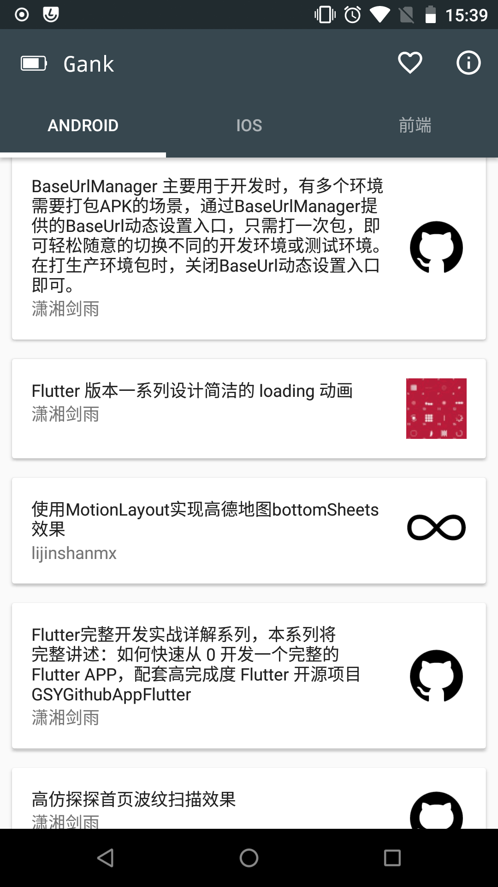

## GankIO

>每日分享妹子图和技术干货，还有供大家中午休息的休闲视频。——干货集中营

提供技术干货。数据来源于[干货集中营](http://gank.io/)。非常感谢 [@代码家](http://weibo.com/u/1628291124?topnav=1&wvr=6&topsug=1&is_all=1)

 

## 下载
[下载](https://github.com/Temoa/GankIO/blob/master/apk)

## Built with the help of these awesome libraries

* [RxJava](https://github.com/ReactiveX/RxJava)
* [RxAndroid](https://github.com/ReactiveX/RxAndroid)
* [Retrofit](https://github.com/square/retrofit)
* [Gson](https://github.com/google/gson)
* [Glide](https://github.com/bumptech/glide)
* [MaterialViewPager](https://github.com/florent37/MaterialViewPager)

## 不足
* ~~很认真地学习了MVP架构，大概理解了其中的思想，可是敲起代码来感觉不太行。MVP模式应该是这样的吧(╯°口°)╯是这样的吧(╯°口°)╯...~~
* ~~[@Jude95](https://github.com/Jude95)的那句“Retrofit+OkHttp+RxJava配合框架打出成吨的输出”深入♂我心。可是RxJava还没有完全搞懂，项目中还未使用。~~
* 还有很多的不足，欢迎指出，真心的，一个人撸代码非常的寂寞呀，欢迎交流学习呀。

## 联系方式
email：temoa_yui@163.com

weibo：[Tem0a_](http://weibo.com/lailaizuiaiyiyi/profile?rightmod=1&wvr=6&mod=personinfo)

欢迎交流学习
